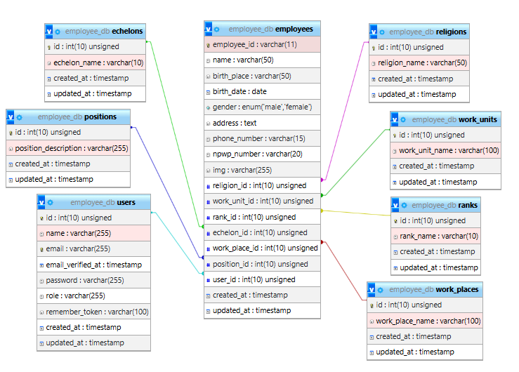
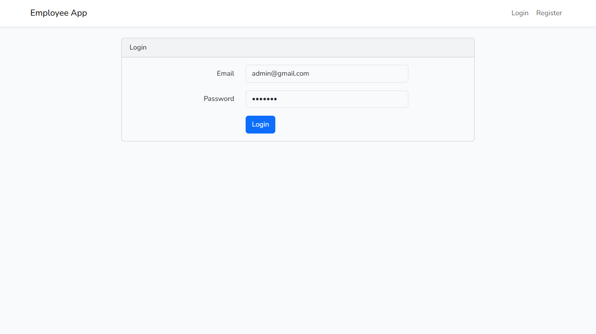
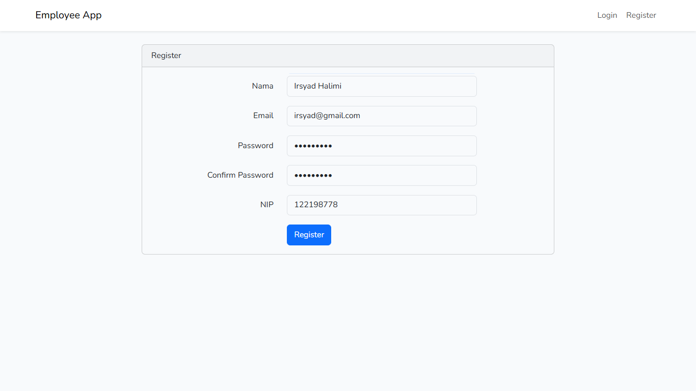
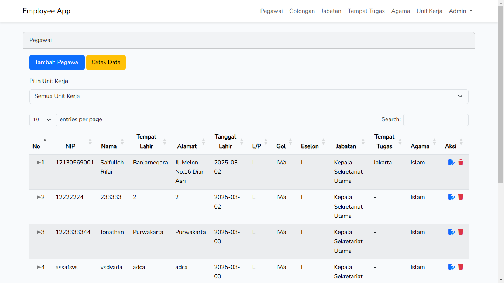
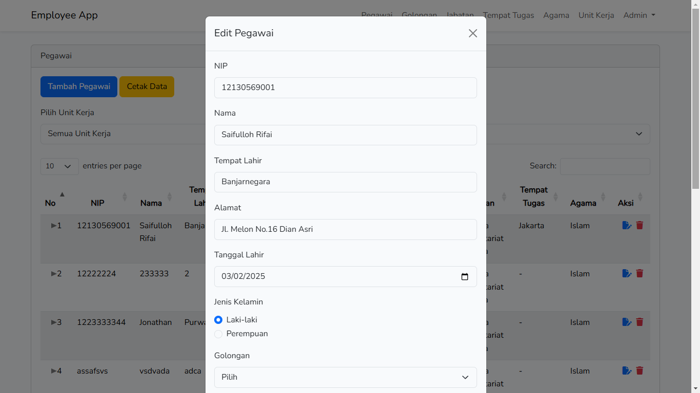
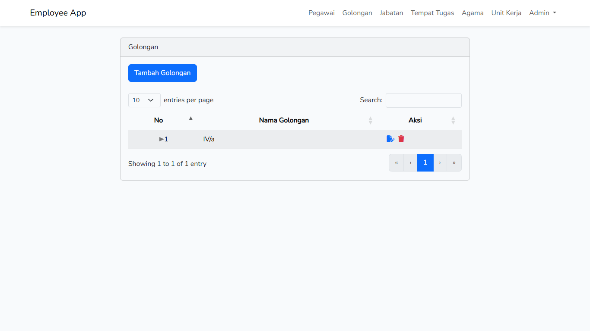

## Employee App

## Deskripsi Proyek

Aplikasi ini berfungsi untuk mengelola data pegawai, melakukan penyimpanan data ke dalam database, mengubah dan menampilkannya melalui antarmuka web. Fitur yang tersedia meliputi:

-   Menampilkan data pegawai
-   Menampilkan data pegawai berdasarkan unit kerja tertentu
-   Menambahkan data pegawai
-   Mengubah data pegawai
-   Menghapus data pegawai
-   Mencetak data pegawai
-   Upload Foto pegawai
-   CRUD untuk data Golongan, Jabatan, Eselon, Tempat Tugas, Agama, dan Unit Kerja
-   Validasi form input

## Teknologi yang Digunakan

-   Framework: Laravel 9
-   Database: MySQL
-   Bahasa Pemrograman: PHP
-   Frontend: Bootstrap 5

### Struktur Database


Detail -> https://drive.google.com/file/d/1DHsNAGyFjMJ7Tui4XHmGpjdEoWmDCurn/view?usp=sharing

### Roles

-   Admin (Mengelola data pegawai)
-   Employee (Melihat data pribadi)

## Instalasi & Konfigurasi

Pastikan sudah terpasang beberapa komponen utama ini pada perangkat komputer anda untuk dapat menjalankan program aplikasi

-   Git
-   Composer: Minimal Composer 2.0
-   PHP: Minimal PHP 8.0
-   MySQL / MariaDB:
    MySQL minimal MySQL 5.7 ke atas.
    MariaDB minimal MariaDB 10.3 ke atas.

### 1. Clone Repository

```sh
git clone https://github.com/IrsyadHalimi/employee-app.git
cd employee-app
```

### 2. Lakukan update dependencies

Dengan beberapa command ini:

```
composer update
```

```
npm install
```

### 3. Konfigurasi dan Database

Buat database baru menggunakan MySQL, sesuaikan nama database dengan file (.env) dan lakukan migrasi, dengan perintah berikut

```
php artisan storage:link
```

```
php artisan migrate
```

Untuk mengisi beberapa data dan user Admin default pada tabel, jalankan perintah berikut

```
php artisan db:seed
```

### 4. Jalankan Aplikasi

```
php artisan serve
```

Buka/tambah tab baru pada terminal, lalu jalankan perintah ini untuk mengaktifkan fungsi vite UI

```
npm run dev
```

Buka url di browser: `http://localhost:8000/`

## Struktur Proyek

```
📦app
 ┣ 📂Http
 ┃ ┣ 📂Controllers
 ┃ ┃ ┣ 📂Admin
 ┃ ┃ ┃ ┣ 📜EchelonController.php
 ┃ ┃ ┃ ┣ 📜EmployeeController.php
 ┃ ┃ ┃ ┣ 📜PositionController.php
 ┃ ┃ ┃ ┣ 📜RankController.php
 ┃ ┃ ┃ ┣ 📜ReligionController.php
 ┃ ┃ ┃ ┣ 📜WorkPlaceController.php
 ┃ ┃ ┃ ┗ 📜WorkUnitController.php
 ┃ ┃ ┣ 📂Auth
 ┃ ┃ ┃ ┣ 📜ConfirmPasswordController.php
 ┃ ┃ ┃ ┣ 📜ForgotPasswordController.php
 ┃ ┃ ┃ ┣ 📜LoginController.php
 ┃ ┃ ┃ ┣ 📜RegisterController.php
 ┃ ┃ ┃ ┣ 📜ResetPasswordController.php
 ┃ ┃ ┃ ┗ 📜VerificationController.php
 ┃ ┃ ┣ 📂Employee
 ┃ ┃ ┃ ┗ 📜EmployeeProfileController.php
 ┃ ┃ ┣ 📜Controller.php
 ┃ ┃ ┗ 📜HomeController.php
 ┣ 📂Models
 ┃ ┣ 📜Echelon.php
 ┃ ┣ 📜Employee.php
 ┃ ┣ 📜Position.php
 ┃ ┣ 📜Rank.php
 ┃ ┣ 📜Religion.php
 ┃ ┣ 📜User.php
 ┃ ┣ 📜WorkPlace.php
 ┃ ┗ 📜WorkUnit.php
📦resources
 ┗ 📂views
 ┃ ┣ 📂admin
 ┃ ┃ ┣ 📂echelon
 ┃ ┃ ┃ ┣ 📜create-echelon-modal.blade.php
 ┃ ┃ ┃ ┣ 📜edit-echelon-modal.blade.php
 ┃ ┃ ┃ ┗ 📜index.blade.php
 ┃ ┃ ┣ 📂employee
 ┃ ┃ ┃ ┣ 📜create-employee-modal.blade.php
 ┃ ┃ ┃ ┣ 📜edit-employee-modal.blade.php
 ┃ ┃ ┃ ┣ 📜index.blade.php
 ┃ ┃ ┃ ┗ 📜print-pdf.blade.php
 ┃ ┃ ┣ 📂position
 ┃ ┃ ┃ ┣ 📜create-position-modal.blade.php
 ┃ ┃ ┃ ┣ 📜edit-position-modal.blade.php
 ┃ ┃ ┃ ┗ 📜index.blade.php
 ┃ ┃ ┣ 📂rank
 ┃ ┃ ┃ ┣ 📜create-rank-modal.blade.php
 ┃ ┃ ┃ ┣ 📜edit-rank-modal.blade.php
 ┃ ┃ ┃ ┗ 📜index.blade.php
 ┃ ┃ ┣ 📂religion
 ┃ ┃ ┃ ┣ 📜create-religion-modal.blade.php
 ┃ ┃ ┃ ┣ 📜edit-religion-modal.blade.php
 ┃ ┃ ┃ ┗ 📜index.blade.php
 ┃ ┃ ┣ 📂work-place
 ┃ ┃ ┃ ┣ 📜create-work-place-modal.blade.php
 ┃ ┃ ┃ ┣ 📜edit-work-place-modal.blade.php
 ┃ ┃ ┃ ┗ 📜index.blade.php
 ┃ ┃ ┣ 📂work-unit
 ┃ ┃ ┃ ┣ 📜create-work-unit-modal.blade.php
 ┃ ┃ ┃ ┣ 📜edit-work-unit-modal.blade.php
 ┃ ┃ ┃ ┗ 📜index.blade.php
 ┃ ┃ ┗ 📜index.blade.php
 ┃ ┣ 📂auth
 ┃ ┃ ┣ 📂passwords
 ┃ ┃ ┃ ┣ 📜confirm.blade.php
 ┃ ┃ ┃ ┣ 📜email.blade.php
 ┃ ┃ ┃ ┗ 📜reset.blade.php
 ┃ ┃ ┣ 📜login.blade.php
 ┃ ┃ ┣ 📜register.blade.php
 ┃ ┃ ┗ 📜verify.blade.php
 ┃ ┣ 📂components
 ┃ ┃ ┣ 📂filters
 ┃ ┃ ┃ ┗ 📜select-filter.blade.php
 ┃ ┃ ┣ 📂forms
 ┃ ┃ ┃ ┗ 📜input-form.blade.php
 ┃ ┃ ┗ 📂tables
 ┃ ┃ ┃ ┗ 📜table-data.blade.php
 ┃ ┣ 📂employee
 ┃ ┃ ┗ 📂profile
 ┃ ┃ ┃ ┗ 📜index.blade.php
 ┃ ┣ 📂layouts
 ┃ ┃ ┗ 📜app.blade.php
 ┃ ┣ 📜home.blade.php
 ┃ ┗ 📜welcome.blade.php
```

## Tampilan








---

<p align="center"><a href="https://laravel.com" target="_blank"></a></p>

<p align="center">
<a href="https://github.com/laravel/framework/actions"></a>
<a href="https://packagist.org/packages/laravel/framework"></a>
<a href="https://packagist.org/packages/laravel/framework"></a>
<a href="https://packagist.org/packages/laravel/framework"></a>
</p>

## About Laravel

Laravel is a web application framework with expressive, elegant syntax. We believe development must be an enjoyable and creative experience to be truly fulfilling. Laravel takes the pain out of development by easing common tasks used in many web projects, such as:

-   [Simple, fast routing engine](https://laravel.com/docs/routing).
-   [Powerful dependency injection container](https://laravel.com/docs/container).
-   Multiple back-ends for [session](https://laravel.com/docs/session) and [cache](https://laravel.com/docs/cache) storage.
-   Expressive, intuitive [database ORM](https://laravel.com/docs/eloquent).
-   Database agnostic [schema migrations](https://laravel.com/docs/migrations).
-   [Robust background job processing](https://laravel.com/docs/queues).
-   [Real-time event broadcasting](https://laravel.com/docs/broadcasting).

Laravel is accessible, powerful, and provides tools required for large, robust applications.

## Learning Laravel

Laravel has the most extensive and thorough [documentation](https://laravel.com/docs) and video tutorial library of all modern web application frameworks, making it a breeze to get started with the framework.

You may also try the [Laravel Bootcamp](https://bootcamp.laravel.com), where you will be guided through building a modern Laravel application from scratch.

If you don't feel like reading, [Laracasts](https://laracasts.com) can help. Laracasts contains over 2000 video tutorials on a range of topics including Laravel, modern PHP, unit testing, and JavaScript. Boost your skills by digging into our comprehensive video library.

## Laravel Sponsors

We would like to extend our thanks to the following sponsors for funding Laravel development. If you are interested in becoming a sponsor, please visit the Laravel [Patreon page](https://patreon.com/taylorotwell).

### Premium Partners

-   **[Vehikl](https://vehikl.com/)**
-   **[Tighten Co.](https://tighten.co)**
-   **[Kirschbaum Development Group](https://kirschbaumdevelopment.com)**
-   **[64 Robots](https://64robots.com)**
-   **[Cubet Techno Labs](https://cubettech.com)**
-   **[Cyber-Duck](https://cyber-duck.co.uk)**
-   **[Many](https://www.many.co.uk)**
-   **[Webdock, Fast VPS Hosting](https://www.webdock.io/en)**
-   **[DevSquad](https://devsquad.com)**
-   **[Curotec](https://www.curotec.com/services/technologies/laravel/)**
-   **[OP.GG](https://op.gg)**
-   **[WebReinvent](https://webreinvent.com/?utm_source=laravel&utm_medium=github&utm_campaign=patreon-sponsors)**
-   **[Lendio](https://lendio.com)**

## Contributing

Thank you for considering contributing to the Laravel framework! The contribution guide can be found in the [Laravel documentation](https://laravel.com/docs/contributions).

## Code of Conduct

In order to ensure that the Laravel community is welcoming to all, please review and abide by the [Code of Conduct](https://laravel.com/docs/contributions#code-of-conduct).

## Security Vulnerabilities

If you discover a security vulnerability within Laravel, please send an e-mail to Taylor Otwell via [taylor@laravel.com](mailto:taylor@laravel.com). All security vulnerabilities will be promptly addressed.

## License

The Laravel framework is open-sourced software licensed under the [MIT license](https://opensource.org/licenses/MIT).
